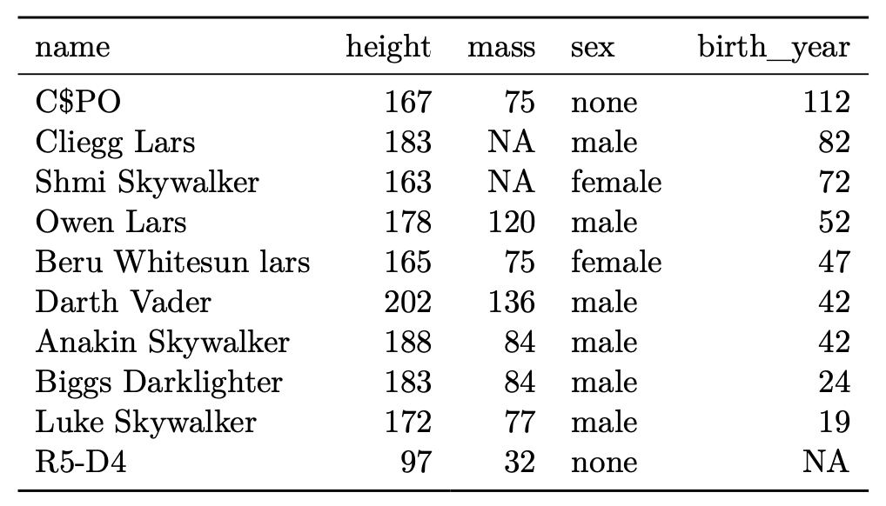

<!-- README.md is generated from README.Rmd. Please edit that file -->

```{r, include = FALSE}
knitr::opts_chunk$set(
  collapse = TRUE,
  eval = FALSE,
  comment = "#>",
  fig.path = "man/figures/README-",
  out.width = "100%"
)
```

# tabularray

<!-- badges: start -->
[](https://lifecycle.r-lib.org/articles/stages.html#experimental)
[](https://CRAN.R-project.org/package=tabularray)
<!-- badges: end -->

This package lets you typeset R objects such as dataframes in LaTeX using [tabularray][1]. [tabularray][1] is a LaTeX package developed by Jianrui Lyu that provides a modern and unified alternative to the established space of table-generating packages in LaTeX. This implementation in R is inspired by the R package [gt][2]. That means we construct a table iteratively, adding formatting by chaining functions together. Unlike [gt][2], however, this package focuses on LaTeX output. It intends to maximize access the functionality of the (LaTeX) [tabularray][1] package while offering convenience functions for the most common formatting tasks.

[1]: https://github.com/lvjr/tabularray
[2]: https://github.com/rstudio/gt

## Installation

You can install the development version of tabularray from [GitHub](https://github.com) with:

``` r
# install.packages("devtools")
devtools::install_github("turbanisch/tabularray")
```

## Examples

In the example below, we format the same dataset twice to demonstrate how tabularray works out of the box and with more fine-tuning applied.

```{r setup}
library(dplyr)
library(tabularray)

df <- starwars |> 
  filter(homeworld == "Tatooine") |>
  select(name, height, mass, sex, birth_year) |> 
  arrange(desc(birth_year))

df[1, 1] <- "C$PO"
```

### Simple table

```{r}
tblr(df)
```



### Table with markup

```{r}
df |> 
  mutate(sex = stringr::str_to_title(sex)) |> 
  group_by(sex) |>
  tblr(type = "float", caption = "Starwars Creatures from Tatooine") |> 
  set_source_notes(
    Note = "Entry C3PO altered to test characters that have a special meaning in LaTeX.",
    Source = "R package \\texttt{dplyr}"
  ) |> 
  set_alignment(height:birth_year ~ "X[r]") |> 
  set_column_labels(
    name = "",
    height = "Height",
    mass = "Mass",
    birth_year = "Birth Year"
  ) |> 
  set_theme(row_group_style = "panel") |> 
  set_interface(width = "0.7\\linewidth") |> 
  set_column_spanner(
    c(height, mass) ~ "Group 1",
    birth_year ~ "Group 2"
  ) |> 
  set_column_spanner(!name ~ "All my vars")
```


## Usage with Quarto and R Markdown

The tabularray package produces LaTeX code that you can copy and paste into your favorite LaTeX editor. However, it is designed to shine in combination with literate programming. Integration is seamless: just make sure to load the necessary LaTeX packages in your document. 

In a Quarto document's YAML metadata, please include

```yaml
format:
  pdf:
    include-in-header: tabularray-packages.sty
```
    
The `tabularray_packages.sty` file would then contain the dependencies listed below:

```latex
\usepackage{tabularray}
\UseTblrLibrary{booktabs}
```

You do not need to modify any chunk options. knitr will automatically embed the LaTeX markup verbatim.
