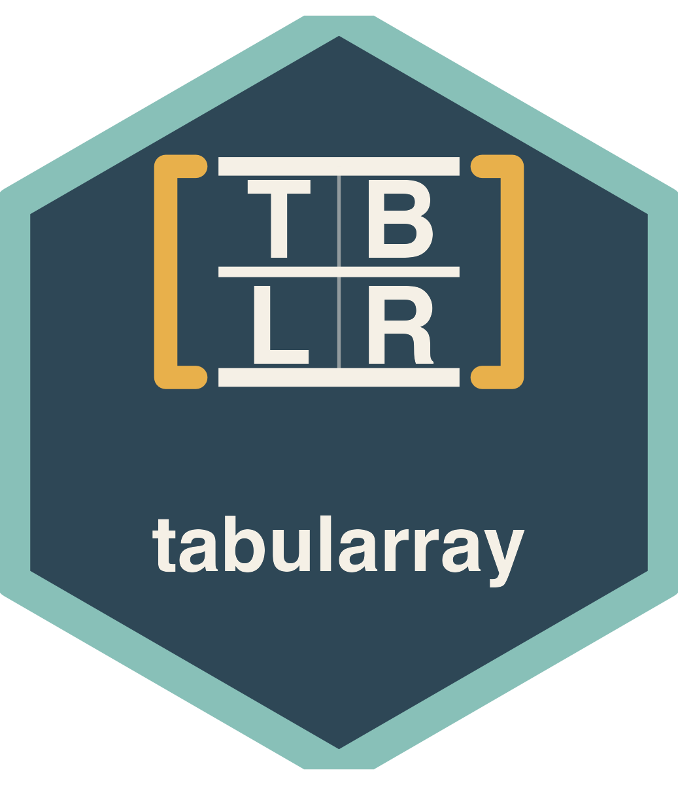
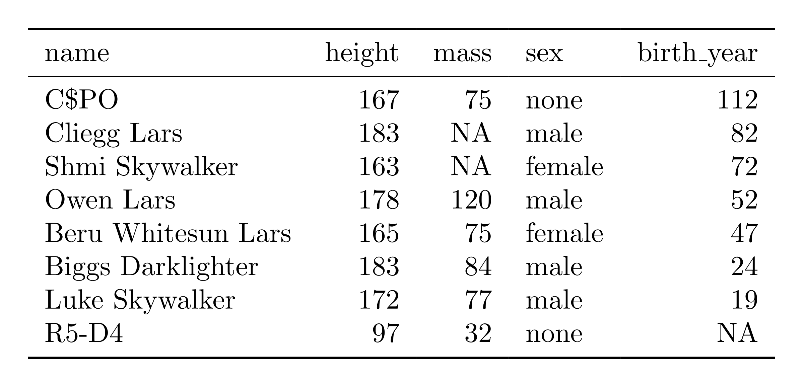
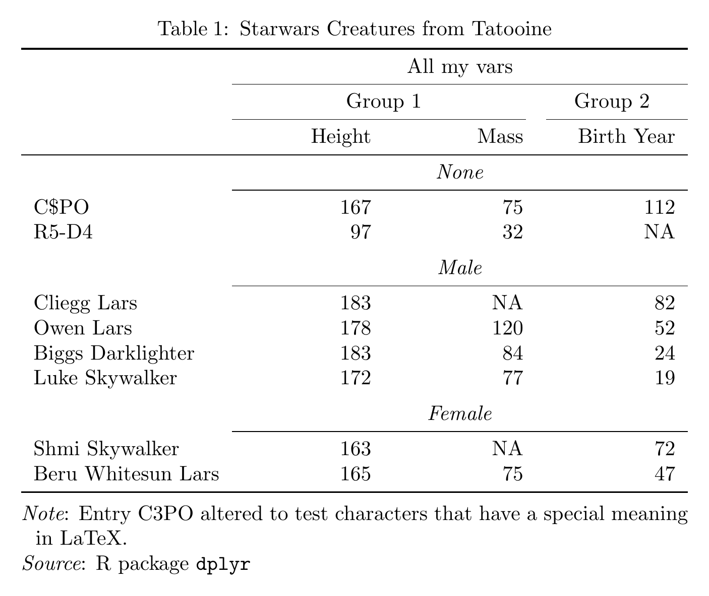

<!-- README.md is generated from README.Rmd. Please edit that file -->

# tabularray 

<!-- badges: start -->

[](https://lifecycle.r-lib.org/articles/stages.html#experimental)
[](https://github.com/turbanisch/tabularray/actions/workflows/R-CMD-check.yaml)
<!-- badges: end -->

This package lets you typeset R objects such as dataframes in LaTeX
using [tabularray](https://github.com/lvjr/tabularray).
[tabularray](https://github.com/lvjr/tabularray) is a LaTeX package
developed by Jianrui Lyu that provides a modern and unified alternative
to the established space of table-generating packages in LaTeX. This
implementation in R is inspired by the R package
[gt](https://github.com/rstudio/gt). That means we construct a table
iteratively, adding formatting by chaining functions together. Unlike
[gt](https://github.com/rstudio/gt), however, this package focuses on
LaTeX output. It intends to maximize access the functionality of the
(LaTeX) [tabularray](https://github.com/lvjr/tabularray) package while
offering convenience functions for the most common formatting tasks.

## Installation

You can install the development version of tabularray from
[GitHub](https://github.com) with:

``` r
# install.packages("devtools")
devtools::install_github("turbanisch/tabularray")
```

## Examples

In the example below, we format the same dataset twice to demonstrate
how tabularray works out of the box and with more fine-tuning applied.

``` r
library(dplyr)
library(tabularray)

df <- starwars |>
  filter(homeworld == "Tatooine", !name %in% c("Anakin Skywalker", "Darth Vader")) |>
  select(name, height, mass, sex, birth_year) |>
  arrange(desc(birth_year))

df[1, 1] <- "C$PO"
```

### Simple table

``` r
tblr(df)
```

<p align="center">


</p>

### Table with markup

``` r
df |> 
  mutate(sex = stringr::str_to_title(sex)) |> 
  group_by(sex) |>
  tblr(type = "float", caption = "Starwars Creatures from Tatooine") |> 
  set_source_notes(
    Note = "Entry C3PO altered to test characters that have a special meaning in LaTeX.",
    Source = "R package \\texttt{dplyr}"
  ) |> 
  set_colspec(height:birth_year ~ "X[r]") |>
  set_column_labels(
    name = "",
    height = "Height",
    mass = "Mass",
    birth_year = "Birth Year"
  ) |> 
  set_theme(row_group_style = "panel") |> 
  set_interface(width = "0.7\\linewidth") |> 
  set_column_spanner(
    c(height, mass) ~ "Group 1",
    birth_year ~ "Group 2"
  ) |> 
  set_column_spanner(!name ~ "All my vars")
```

<p align="center">


</p>

## Usage with Quarto and R Markdown

The tabularray package produces LaTeX code that you can copy and paste
into your favorite LaTeX editor. However, it is designed to shine in
combination with literate programming. Integration is seamless: just
make sure to load the necessary LaTeX packages in your document.

In a Quarto document’s YAML metadata, please include

``` yaml
format:
  pdf:
    include-in-header: tabularray-packages.sty
```

The `tabularray_packages.sty` file would then contain the dependencies
listed below:

``` latex
\usepackage{tabularray}
\UseTblrLibrary{booktabs}
```

You do not need to modify any chunk options. knitr will automatically
embed the LaTeX markup verbatim.

## Alternatives

Among the popular table packages, [gt](https://github.com/rstudio/gt),
[kableExtra](https://haozhu233.github.io/kableExtra/), and
[flextable](https://davidgohel.github.io/flextable/) don’t target the
[tabularray](https://github.com/lvjr/tabularray) LaTeX package.
[tinytable](https://vincentarelbundock.github.io/tinytable/) does — a
capable, actively developed, multi-format alternative (LaTeX, HTML,
Typst, Word) that for many projects is the better choice.

This package is deliberately narrower: a tidyverse- and gt-inspired
interface built only for `tabularray`. It leans on two things. First,
opinionated defaults for layouts common in academic publishing —
row-group “panel” styling, column spanners, and a natural stub column.
Second, direct per-column access to raw `tabularray` code: column
specifications (e.g. `siunitx` `S` or `X[r]` columns), labels, spanners,
notes, and the inner/outer specifications all accept raw strings.
